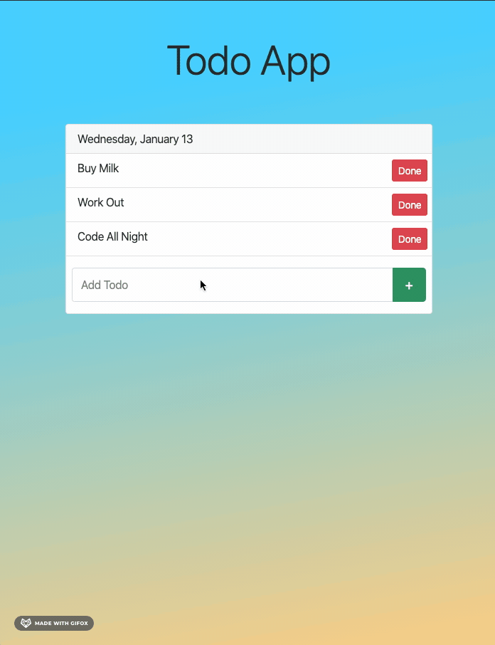

# ToDo App

## About the App

    A simple ToDo app that implements a full stack technology
    Built with NodeJS, MongoDB, Express and EJS

## Run app locally

    1. Clone repo
    2. `cd` in the folder
    3. Run `brew services start mongodb-community@4.4` to start mongoDB
    4. Run `npm i` to install dependencies
    5. Run `node index.js`  or `nodemon index.js` to start the srever
    6. Open localhost:5000 in your browser
    7. Enjoy

## App Preview

